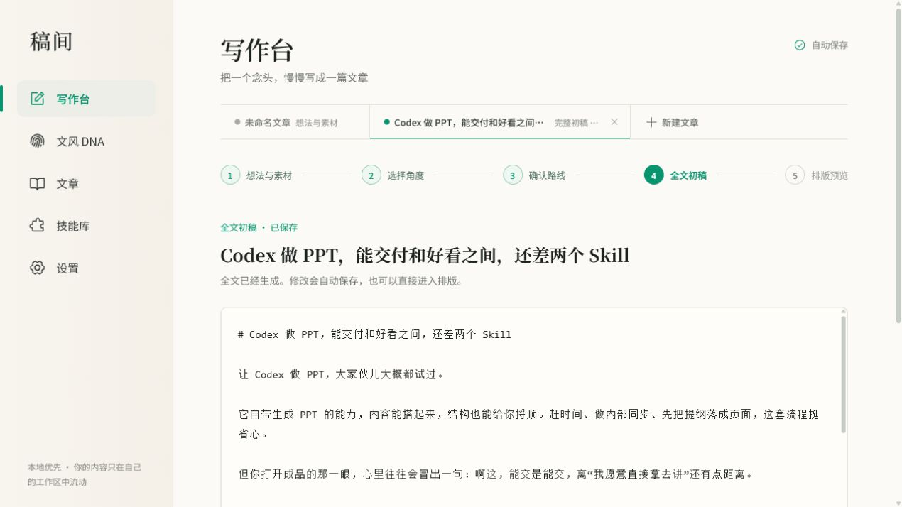
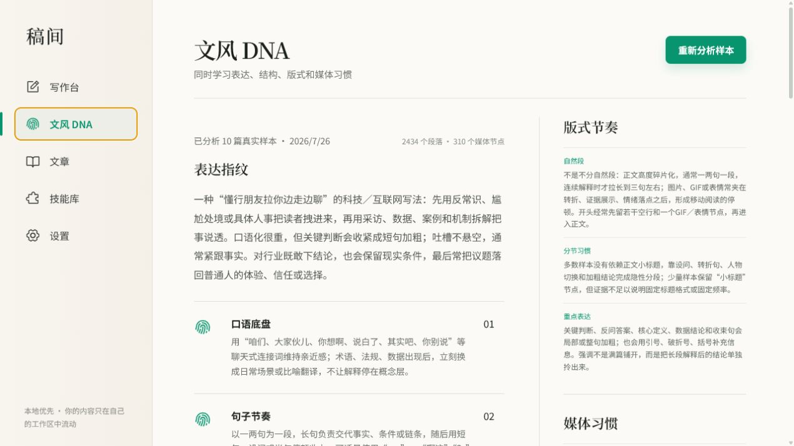
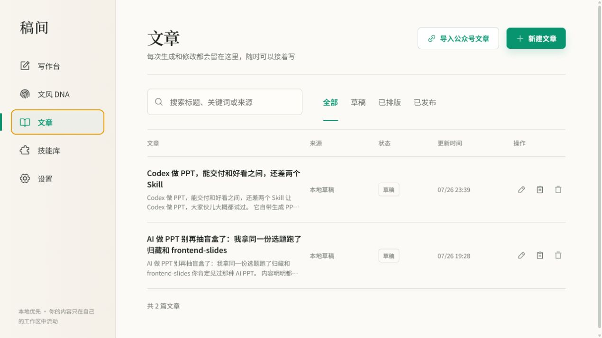
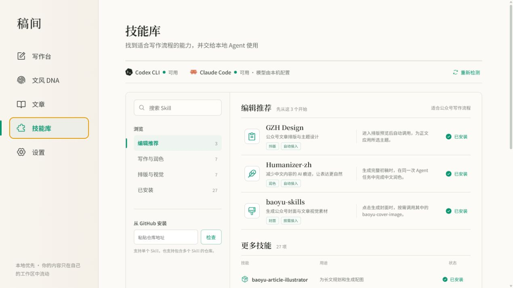
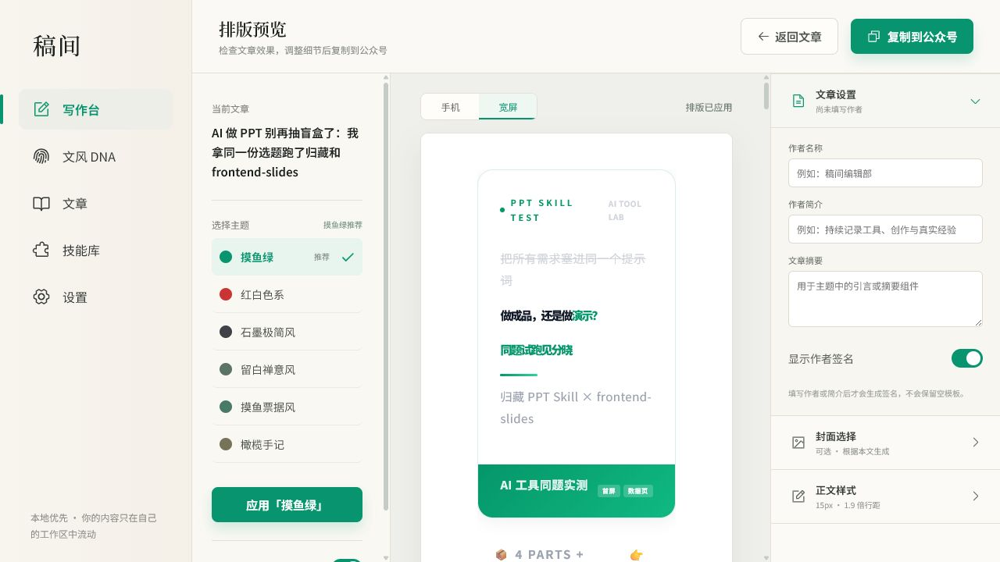

# 稿间

> 由本地 Agent 驱动的微信公众号写作、文风学习与排版工具。

稿间把选题、写作角度、叙事路线、完整初稿和公众号排版串成一条工作流。它可以通过你的参考文章提取“文风 DNA”，再调用本机已经配置好的 Codex CLI 或 Claude Code 完成写作，文章与设置默认保存在本地 SQLite 数据库中。

当前项目仍在持续开发，适合本地体验和共同完善。

## 界面预览

### 写作台

从想法和素材开始，依次完成角度选择、路线确认、全文生成与排版。支持在多个文章任务之间切换，并自动保存修改。



### 文风 DNA

从参考文章中提取表达方式、结构习惯、段落节奏和媒体使用习惯。生成文章时会同时参考 DNA 与相关原文片段，而不只是套用几条固定提示词。



### 文章库

生成过的文章会保存到本地文章库，可以继续编辑、搜索、筛选或直接进入排版预览。



### 技能库

检测本机 Agent 和已安装的 Skill，支持从 GitHub 安装新的能力。编辑推荐中的 Skill 已接入稿间对应流程。



### 排版预览

使用 GZH Design 为文章应用公众号主题，在同一页面调整文章信息、封面和正文样式，并复制到公众号编辑器。



## 主要功能

- **本地 Agent 写作**：支持在写作台选择 Codex CLI 或 Claude Code。
- **文风 DNA**：分析参考文章的表达指纹、结构类型、版式节奏和媒体习惯。
- **完整写作流程**：想法与素材 → 写作角度 → 叙事路线 → 完整初稿 → 排版预览。
- **图片素材**：支持粘贴、拖入或选择本地图片，并将素材关联到叙事路线。
- **实时执行状态**：显示本地 Agent 当前正在整理素材、匹配 DNA、写作还是校验结果。
- **中文去 AI 味**：安装 Humanizer-zh 后，在生成完整初稿的同一次 Agent 任务中完成润色。
- **公众号主题排版**：通过 GZH Design 将 Markdown 转换为微信公众号兼容的 HTML。
- **封面生成**：安装 baoyu-cover-image 后，可按需生成文章封面候选。
- **本地文章库**：文章、设置、文风 DNA 和备份历史使用 SQLite 保存。
- **技能管理**：查看、搜索和安装本地 Skill；普通已安装 Skill 不会被自动塞进文章生成流程。

## Skill 如何参与工作流

| Skill | 调用阶段 | 调用方式 |
| --- | --- | --- |
| GZH Design | 排版预览 | 应用主题时调用 |
| Humanizer-zh | 完整初稿 | 与全文生成合并为同一次 Agent 任务 |
| baoyu-cover-image | 封面选择 | 用户点击生成封面时按需调用 |

其他已安装 Skill 仍可供本地 Agent 使用，但稿间不会在没有明确产品接入的情况下自动调用。

## 技术结构

- React 19
- Vite 6
- Node.js 本地桥接服务
- Node.js SQLite
- Codex CLI / Claude Code
- Phosphor Icons

数据默认保存在项目根目录的 `.gaojian-data/` 中，其中包含：

- `gaojian.db`：文章、设置、文风 DNA 和工作区状态
- `assets/`：封面等本地文件
- `backups/`：SQLite 备份

该目录已经加入 `.gitignore`，不会随代码提交到 GitHub。

## 快速开始

### 环境要求

- Windows 10/11
- Node.js 22 或更高版本
- Git
- 至少安装并配置一个本地 Agent：
  - [Codex CLI](https://developers.openai.com/codex/cli/)
  - [Claude Code](https://docs.anthropic.com/en/docs/claude-code/overview)

### 安装

```bash
git clone https://github.com/yooface/gaojian-wexin-mp.git
cd gaojian-wexin-mp
npm install
```

### 启动本地版本

```bash
npm run desktop
```

启动完成后访问：

```text
http://127.0.0.1:4174/
```

### 开发模式

先启动本地数据与 Agent 桥接服务：

```bash
node server/local-bridge.mjs
```

再启动 Vite：

```bash
npm run dev
```

Vite 会把 `/api` 请求代理到 `http://127.0.0.1:4174`。

## 可选 Skill

稿间可以从技能库安装以下能力：

- [GZH Design](https://github.com/isjiamu/gzh-design-skill)：公众号排版与主题
- [Humanizer-zh](https://github.com/op7418/Humanizer-zh)：减少中文内容的 AI 痕迹
- [baoyu-skills](https://github.com/JimLiu/baoyu-skills)：封面与视觉能力集合

如果国内网络无法直连 GitHub，请先确保 Git 能使用你的本地代理。稿间的 Skill 安装器会尝试读取 Windows 系统代理，但命令行 Git 仍可能需要单独配置。

## 常用命令

```bash
# 构建
npm run build

# 运行测试
npm test

# 仅运行 Sites 相关测试
npm run test:sites
```

## 项目目录

```text
gaojian-wexin-mp/
├─ src/                 # React 界面
├─ server/              # 本地 Agent、SQLite 与 Skill 调用
├─ worker/              # Sites 静态站点入口
├─ scripts/             # 构建与打包脚本
├─ tests/               # 自动化测试
├─ docs/screenshots/    # README 截图
└─ .gaojian-data/       # 本地数据，不提交到 Git
```

## 注意事项

- 稿间不会提供或代管 Codex、Claude 等模型账户，实际额度与模型由本机 Agent 配置决定。
- 微信公众号链接能否读取，取决于页面状态和本地浏览器能力；读取失败时需要粘贴正文。
- 封面生成依赖可用的图片生成后端，安装 Skill 本身不等于已经配置好图片模型。
- 项目名称、界面与工作流仍在快速迭代中，欢迎提交 Issue 或 Pull Request。
